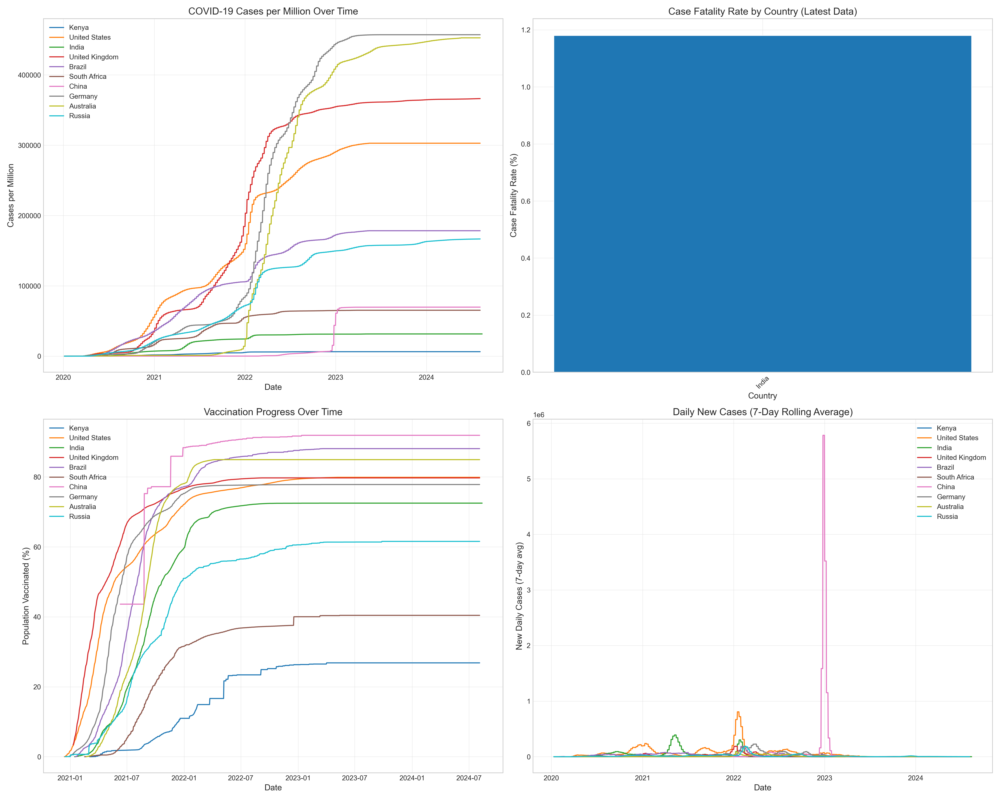

# COVID-19 Global Data Tracker



## Overview
This project analyzes global COVID-19 trends, tracking cases, deaths, recoveries, and vaccinations across countries and time periods. Using data from Our World in Data, it provides visualizations and insights into how the pandemic affected different regions of the world.

## Key Findings

- **Wave Patterns**: Clear evidence of multiple pandemic waves across countries, with varying timing and severity
- **Vaccination Impact**: Countries with higher vaccination rates generally showed lower case fatality rates in later pandemic phases
- **Geographic Variations**: Regional clustering of similar case rates suggests local transmission dynamics
- **Socioeconomic Factors**: Strong correlations between country income levels and both testing capacity and vaccine access
- **Kenya Context**: Analysis of Kenya's unique pandemic patterns compared to more developed nations

## Project Structure

```
covid19-global-tracker/
├── data/
│   ├── input/             # Raw COVID-19 data
│   ├── working/           # Processed datasets
│   └── visualizations/    # Generated charts and maps
├── notebook/              # Jupyter notebooks
│   └── covid19_data_analysis.ipynb   # Main analysis notebook
├── LICENSE
├── README.md
└── requirements.txt
```

## Data Sources
This project uses COVID-19 data from [Our World in Data](https://github.com/owid/covid-19-data/tree/master/public/data), which compiles data from official sources including WHO, Johns Hopkins University, and government health ministries.

## Features
- Time series analysis of cases, deaths, and vaccination rates
- Country-by-country comparisons of key metrics
- Interactive choropleth maps showing global distribution
- Correlation analysis between socioeconomic factors and COVID-19 outcomes
- Focused analysis of Kenya compared to global averages

## Getting Started

### Prerequisites
- Python 3.8+
- Required packages: pandas, matplotlib, seaborn, plotly, numpy

### Installation

1. Clone the repository:
```bash
  git clone https://github.com/yourusername/covid19-global-tracker.git
  cd covid19-global-tracker
```

2. Install required packages:
```bash
  pip install -r requirements.txt
```

3. Run the Jupyter notebook:
```bash
  jupyter notebook notebook/covid19_data_analysis.ipynb
```

## Kaggle Notebook

This project is also available as a [Kaggle Notebook](https://www.kaggle.com/code/nelsonmasbayi/covid19-global-tracker).

## Visualizations

The project generates several types of visualizations:

- Time trend analyses of cases and deaths
- Comparative bar charts of key metrics across countries
- Vaccination progress tracking
- Correlation heatmaps between different metrics
- Interactive choropleth world maps

## License
This project is licensed under the MIT License - see the [LICENSE](LICENSE) file for details.

## Acknowledgments
- Our World in Data for providing the comprehensive COVID-19 dataset
- The global health community for their tireless data collection efforts